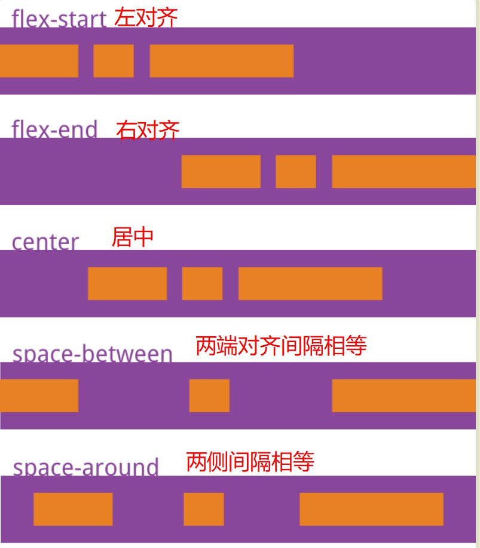
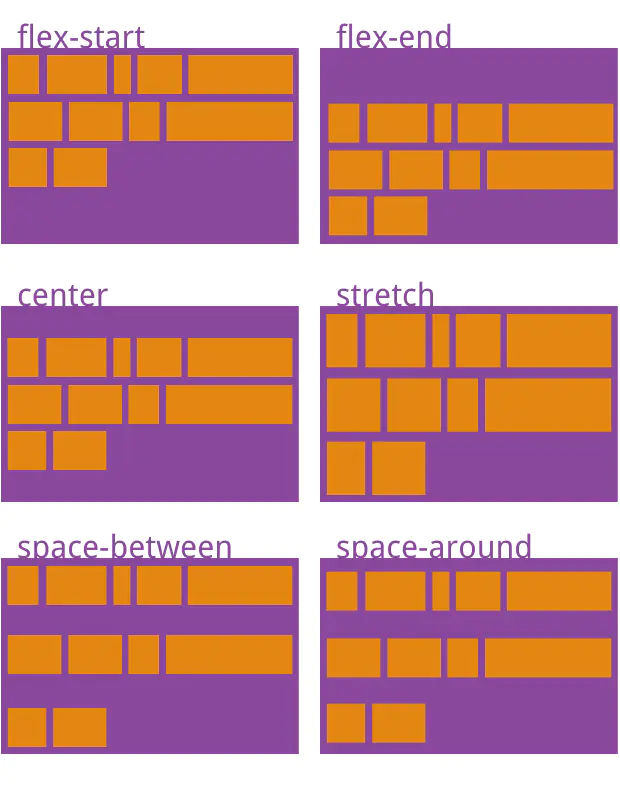

# Flex 布局

Flex 是 Flexible Box 的缩写，意思为“弹性布局”

## 特点

1. 块级布局侧重垂直方向、行内布局侧重水平方向，而 Flex 布局是与方向无关的
2. Flex 布局可以实现空间自动分配、自动对齐（弹性、灵活）
3. Flex 布局适用于简单的线性布局，更复杂的布局使用 Grid 布局

## 容器

开启 Flex 布局的元素，可以看做一个 Flex 容器

```css
.bigBox {
  display: flex;
}
```

Flex 容器默认有两根轴：主轴（main axis）和侧轴（cross axis）。

在默认情况下主轴是水平分布的，侧轴是垂直分布的，但可以通过`flex-direction`来改变主侧轴的分布方向。所以并不能说，水平分布的是主轴，垂直分布的是侧轴。

# 父元素的属性

## flex-direction 主轴方向

决定主轴（main axis）的方向

属性值：

> row: 默认值，从左到右；column: 从上到下；
> row-reverse: 从右到左；column-reverse: 从下到上

代码实践

```html
<style>
  .bigBox {
    display: flex;
    width: 100%;
    height: 100vh;
    background-color: beige;
    /* flex-direction: row; */
    /* flex-direction: column; */
    /* flex-direction: row-reverse; */
    /* flex-direction: column-reverse; */
  }
  .smallBox {
    width: 500px;
    height: 200px;
    margin: 10px;
  }
  .smallBox1 {
    background-color: blueviolet;
  }
  .smallBox2 {
    background-color: palevioletred;
  }
  .smallBox3 {
    background-color: brown;
  }
</style>
<body>
  <div class="bigBox">
    <h3>bigBox</h3>
    <div class="smallBox smallBox1">
      <h3>smallBox1</h3>
    </div>
    <div class="smallBox smallBox2">
      <h3>smallBox2</h3>
    </div>
    <div class="smallBox smallBox3">
      <h3>smallBox3</h3>
    </div>
  </div>
</body>
```

## flex-wrap 子元素换行

默认的情况下，Flex 容器中的子元素都排在一行，如果子元素的总宽度大于父元素的宽度，子元素就会被压缩。`flex-wrap`属性可以设置子元素换行，它一共有 3 个值：

> nowrap: 默认值，不换行
> wrap: 换行，第一行在上方
> wrap: 换行，第一行在下方

## flex-flow 主轴和子元素换行

`flex-flow`属性是`flex-direction`和`flex-wrap`的组合，它是将这两个属性写到一起，

先写`flex-direction`

后写`flex-wrap`

默认值为`row nowrap`

默认值

```css
flex-flow: row nowrap;
```

## justify-content 主轴对齐方式

`justify-content`属性定义子元素在主轴上的对齐方式，它主要有 5 种取值：

> flex-start: 默认值，从起点开始
> flex-end: 从终点对齐
> cneter: 居中对齐
> space-between: 两端对齐，子元素之间的间隔相等
> space-around: 每个子元素的左右间隔相等



## align-items 侧轴对齐方式

`align-items`属性定义子元素在侧轴上的对齐方式，主要由 5 种取值：

> strech: 默认值，子元素的高度铺满父元素
> flex-start: 子元素从侧轴起点对齐
> flex-end: 子元素从侧轴终点对齐
> center: 子元素根据侧轴居中对齐
> baseline: 根据子元素第一行文字的基线对齐(当字体大小不一致时，突出效果)

**注意：** 应用此属性时，子元素的高度不能写死，应该由其内容撑起来


## align-content 多根轴线侧轴上的对齐方式

`align-content` 属性定义子元素多根轴线在侧轴上的对齐方式，只在多行显示下有效。主要取以下 5 个值：

> stretch: 默认值，轴线铺满侧轴
> flex-start: 与侧轴起点对齐
> flex-end: 与侧轴终点对齐
> center: 与侧轴中点对齐
> space-between: 与侧轴两端对齐，轴线之间的间隔相等
> space-around: 每根轴线两侧的间隔相等



# 子元素属性

Flex 布局的子元素共有 6 种属性可以设置，分别为：

## flex-grow

`flex-grow`属性表示当父元素空间有剩余时，将剩余空间分配给各子元素的比例，默认为`0`，表示不分配；当为数值时，表示父元素剩余空间分配给各子元素的比例，不是扩张后子元素的尺寸比例

## flex-shrink

`flex-shrink`属性与`flex-grow`属性的作用相反，表示当子元素宽度总和大于父元素宽度，且未换行显示时，各子元素压缩大小，默认为`1`，表示各子元素等比压缩；当数值不一时，表示各子元素因为压缩空间而减小的尺寸的比例，不是压缩后子元素尺寸的比例

## flex-basis

`flex-basis`属性可以用来设置子元素的空间，默认值为`auto`，表示为原本大小。当父元素有剩余空间时，可通过此属性扩充子元素的空间；各子元素通过扩孔之后的空间总和超过了父元素的空间大小时，按`flex-basis`值比例来设置子元素的大小，没有`flex-basis`属性时，默认`flex-basis`值为子元素原本大小，使子元素大小总和不得超过父元素空间大小

## flex 合集

`flex`属性是`flex-grow`、`flex-shrink`和`flex-basis`的合集，默认值为`0 1 auto`，后两个属性可不写

```css
flex: 0 1 auto;
```

## order

`order`属性定义子元素在排列顺序，默认值为`0`，值越小越靠前。

## align-self

`align-self`属性允许子元素单独设置对齐方式，优先级比父元素的`align-items`高。默认值为`auto`，表示继承父元素的`align-items`，如果没有父元素，则等同于`stretch`。其可设置以下属性：

> auto: 继承父元素的`align-items`
> stretch
> flex-start
> flex-end
> center
> baseline

# Flex 布局应用

## 上中下

```html
<!DOCTYPE html>
<html>
  <head>
    <meta charset="utf-8" />
    <title>Document</title>
    <style>
      body {
        display: flex;
        flex-direction: column;
        height: 100vh;
      }
      header {
        height: 100px;
        background: #ddd;
      }
      main {
        flex-grow: 1;
      }
      footer {
        height: 100px;
        background: #ddd;
      }
    </style>
  </head>
  <body>
    <header>heafer</header>
    <main>main</main>
    <footer>footer</footer>
  </body>
</html>
```

## 九宫格

```html
<!DOCTYPE html>
<html>
  <head>
    <meta charset="utf-8" />
    <title>Document</title>
    <style>
      * {
        padding: 0;
      }
      ul {
        list-style: none;
        border: 1px solid black;
        width: 170px;
        display: flex;
        flex-wrap: wrap;
        justify-content: space-around;
      }
      li {
        width: 50px;
        height: 50px;
        border: 1px solid red;
        margin: 5px 0;
      }
    </style>
  </head>
  <body>
    <ul>
      <li></li>
      <li></li>
      <li></li>
      <li></li>
      <li></li>
      <li></li>
      <li></li>
      <li></li>
      <li></li>
    </ul>
  </body>
</html>
```

## 一般 PC 布局

```html
<!DOCTYPE html>
<html>
  <head>
    <meta charset="utf-8" />
    <title>Document</title>
    <style>
      body {
        display: flex;
        flex-direction: column;
        height: 100vh;
      }
      header {
        height: 50px;
        background: #ddd;
      }
      main {
        flex-grow: 1;
        display: flex;
      }
      .aside1 {
        width: 100px;
        background: #aaa;
      }
      .aside2 {
        flex-grow: 1;
      }
      .aside3 {
        width: 100px;
        background: #aaa;
      }
      footer {
        height: 50px;
        background: #ddd;
      }
    </style>
  </head>
  <body>
    <header>header</header>
    <main>
      <aside class="aside1">aside1</aside>
      <aside class="aside2">aside2</aside>
      <aside class="aside3">aside3</aside>
    </main>
    <footer>footer</footer>
  </body>
</html>
```

### 自适应绝对居中

```html
<!DOCTYPE html>
<html lang="en">
  <head>
    <meta charset="UTF-8" />
    <meta http-equiv="X-UA-Compatible" content="IE=edge" />
    <meta name="viewport" content="width=device-width, initial-scale=1.0" />
    <title>Document</title>
  </head>
  <style>
    * {
      margin: 0;
      padding: 0;
    }
    .box {
      width: 100%;
      height: 100vh;
      border: 1px solid #000;
      display: flex;
      justify-content: center;
      align-items: center;
    }
    main {
      border: 1px solid red;
    }
  </style>
  <body>
    <div class="box">
      <main>内容</main>
    </div>
  </body>
</html>
```

