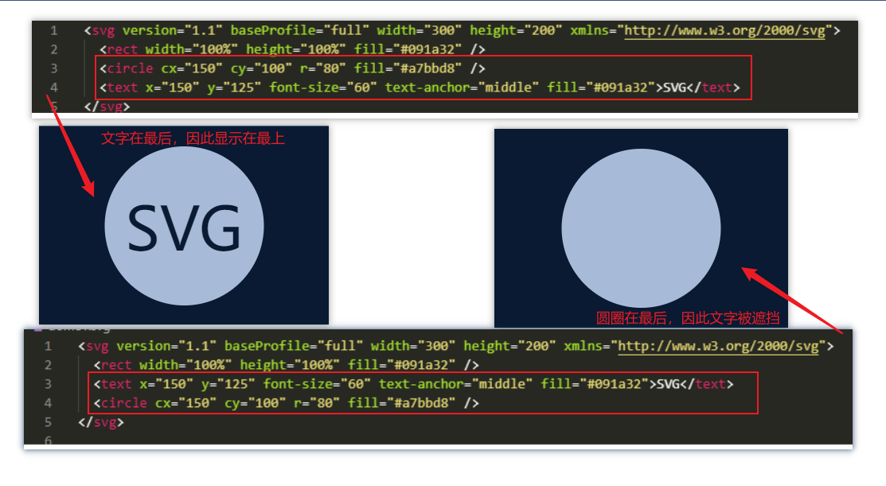
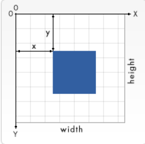

# SVG 学习笔记

## SVG 介绍

[MDN-SVG](https://developer.mozilla.org/zh-CN/docs/Web/SVG)

[MDN - SVG 介绍](https://developer.mozilla.org/zh-CN/docs/Web/SVG/Tutorial)

**可缩放矢量图形**（**Scalable Vector Graphics，SVG**），是一种用于描述二维的[矢量图形](https://zh.wikipedia.org/wiki/矢量图形)，基于 [XML](https://developer.mozilla.org/zh-CN/docs/Web/XML/XML_Introduction) 的标记语言。

[各个浏览器对SVG的支持](https://caniuse.com/svg)


## SVG 入门

栗子:

```xml
<svg version="1.1" baseProfile="full" width="300" height="200" xmlns="http://www.w3.org/2000/svg">
  <rect width="100%" height="100%" fill="#091a32" />
  <circle cx="150" cy="100" r="80" fill="#a7bbd8" />
  <text x="150" y="125" font-size="60" text-anchor="middle" fill="#091a32">SVG</text>
</svg>
```

栗子说明

1. SVG 2之前，version属性和baseProfile属性用来供其他类型的验证识别SVG的版本。SVG 2不推荐使用version和baseProfile这两个属性。
2. 绘制一个完全覆盖图像区域的矩形 `<rect/>`，把背景颜色`fill`设为你想要的颜色。
3. 一个半径`r`80px的圆圈 `<circle/>` 绘制在矩形的正中央 （`cx`向右偏移150px，`cy`向下偏移100px）。
4. 绘制文字“SVG”。 通过设置居中的锚点`text-anchor`把文字定位到期望的位置：在这种情况下，中心点应该对应于圆圈的中点。还可以精细调整字体大小和垂直位置，确保最后的样式是美观的。

> 注意
>
> svg中元素的渲染顺序。SVG文件全局有效的规则是“后来居上”，越后面的元素越可见。



## 坐标定位

### 网格

坐标系统是：以页面的左上角为(0,0)坐标点，坐标以像素为单位，x轴正方向是向右，y轴正方向是向下。注意，这和你小时候所教的绘图方式是相反的。但是在HTML文档中，元素都是用这种方式定位的。

 svg重点色英短

实例元素

```xml
<rect x="0" y="0" width="100" height="100" />
```

### 像素

基本上，在 SVG 文档中的1个像素对应输出设备（比如显示屏）上的1个像素。

```xml
<svg width="200" height="200" viewBox="0 0 100 100">
```

这里定义的画布尺寸是200 x 200px。但是,viewBox属性定义了画布上可以显示的区域：从(0,0)点开始，100宽 x 100高的区域。这个100 x 100的区域，会放到200 x 200的画布上显示。于是就形成了放大两倍的效果。

用户单位和屏幕单位的映射关系被称为**用户坐标系统**。除了缩放之外，坐标系统还可以旋转、倾斜、翻转。默认的用户坐标系统1用户像素等于设备上的1像素（但是设备上可能会自己定义1像素到底是多大）。在定义了具体尺寸单位的SVG中，比如单位是“cm”或“in”，最终图形会以实际大小的1比1比例呈现。