#### AJAX

- Asyn chronous JavaScript And XML，异步的 JS 和 XML。
- 浏览器向服务器发送异步请求，无刷新获取数据

#### XML

- 可扩展标记语言
- 用来传输和存储数据
- 自定义标签，表示数据

（被 JSON 取代）

#### Ajax 特点

优点

- 无需刷新页面与服务端通信
- 允许根据用户事件来更新部分页面内容

缺点

- 无浏览历史，不能回退
- 存在跨域问题（同源）
- SEO 不友好

#### HTTP协议

【超文本传输协议】，详细规定了浏览器和万维网服务器之间的互相通信的规则。

1. 请求报文

   【格式、参数】

   ```
   行		请求类型(Post)	/	URL路径(s?ie=utf-8)	/	版本(HTTP/1.1)
   头		Host: https://baidu.com/
        Cookie:name=baidu
        Content-type:application/x-www-form-urlencoded
        User-Agent:chrome 83
   空行
   体		username=admin&password=admin
   ```

   

2. 响应报文

   ```
   行		HTTP/1.1	200	OK
   头		Content-type:text/html;charset=utf-8
        Content-length:2048
        Content-encoding:gzip
   空行
   体		<html>
   			<head>
   			</head>
   			<body>
   				<h1>Hi</h1>
   			</body>
   		</html>
   ```


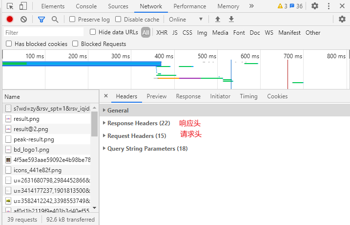

#### Express 使用

安装Express

1. 初始化目录

   ```
   npm init --yes
   ```

2. 安装

   ```SAS
   npm i express
   ```

3. 使用

   【Express基本使用.js】

   ```javascript
   // 1、引入express
   const { response } = require('express');
   const express = require('express');
   // 2、创建应用对象
   const app = express();
   // 3、创建路由规则
   app.get('/', (require, response) => {
     // 设置响应
     response.send("Hello Eaxpress");
   })
   // 4、监听端口启动服务
   app.listen(8000, () => {
     console.log("服务已经启动，8000 端口监听中......");
   })
   ```

4. 启动

   终端

   ```
   node Express基本使用.js 
   ```

   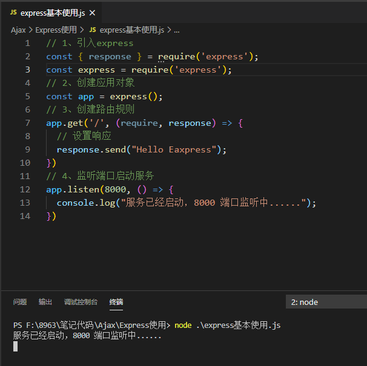


#### Ajax 基本操作

**服务端**

1. 引入express
2. 创建应用对象
3. 创建路由规格
4. 监听端口服务

**网页端**

1. 创建对象
2. 初始化，设置请求和方法
3. 发送请求
4. 事件绑定，处理服务端返回结果

【服务器端server.js】

```JavaScript
// 1、引入express
const { response } = require('express');
const express = require('express');
// 2、创建应用对象
const app = express();
// 3、创建路由规则
app.get('/server', (require, response) => {
  // 设置响应头(设置允许跨域)
  response.setHeader('Access-Control-Allow-Origin', '*');
  // 设置响应体
  response.send("Hello Ajax");
})
// 4、监听端口启动服务
app.listen(8000, () => {
  console.log("服务已经启动，8000 端口监听中......");
})
```

【网页端 GET.html】

```html
<!DOCTYPE html>
<html lang="en">

<head>
  <meta charset="UTF-8">
  <meta name="viewport" content="width=device-width, initial-scale=1.0">
  <title>Ajax GET 请求</title>
</head>
<style>
  #result {
    width: 200px;
    height: 100px;
    border: 1px solid #000;
  }
</style>

<body>
  <button id="btn">点击发送请求</button>
  <div id="result"></div>
  <script>
    // 获取button
    const btn = document.getElementById("btn");
    const result = document.getElementById("result")
    btn.onclick = function () {
      //  1、创建对象
      const xhr = new XMLHttpRequest();
      //  2、初始化，设置请求和方法
      xhr.open("GET", "http://127.0.0.1:8000/server");
      //  3、发送
      xhr.send();
      //  4、事件绑定 处理服务端返回的结果
      xhr.onreadystatechange = function () {
        // 判断请求步骤是否完成
        if (xhr.readyState == 4) {
          // 判断响应状态码
          if (xhr.status >= 200 && xhr.status < 300) {
            // 处理结果 行  头   空行 体
            // console.log(xhr.status);//状态码
            // console.log(xhr.statusText);//状态字符串
            // console.log(xhr.getAllResponseHeaders);//状态码
            // console.log(xhr.response);//响应体
            result.innerHTML = xhr.response;
          }
        }
      }
    }
  </script>
</body>

</html>
```


#### Ajax设置参数请求 - GET


直接在url中设置

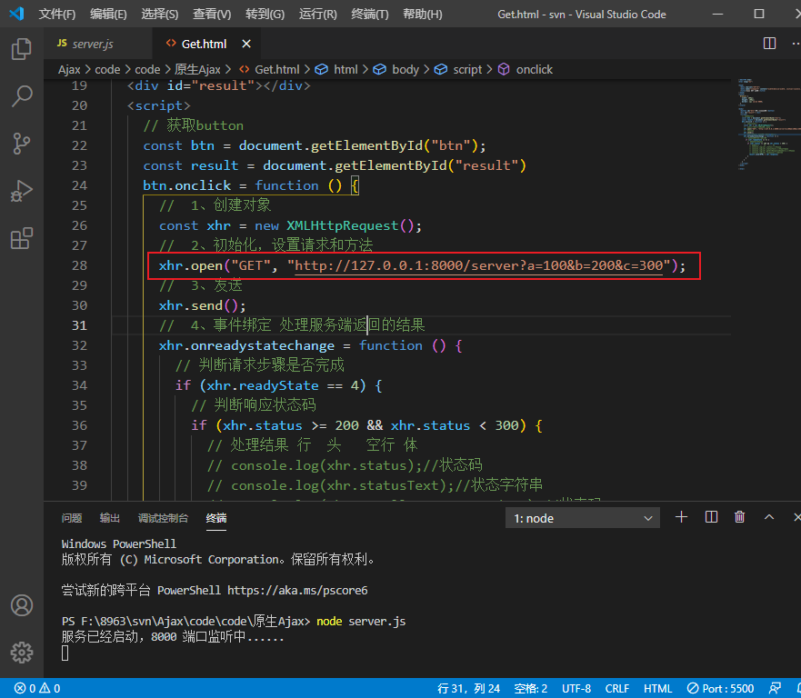

查看参数

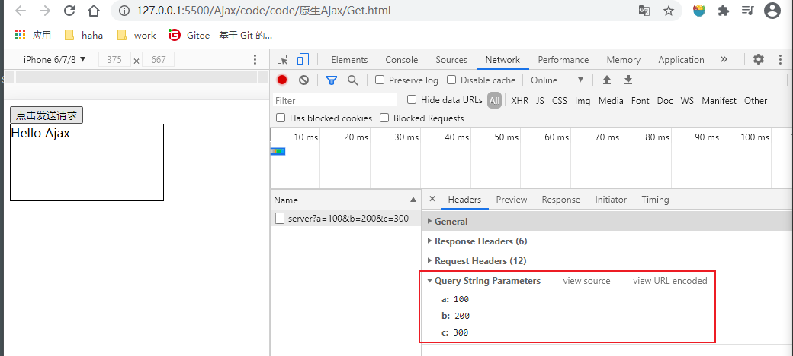


#### Ajax设置参数请求 - POST

在 `send()` 处

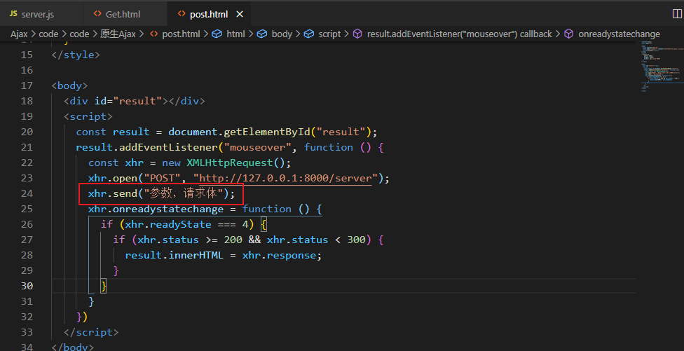


#### Ajax 设置请求头信息

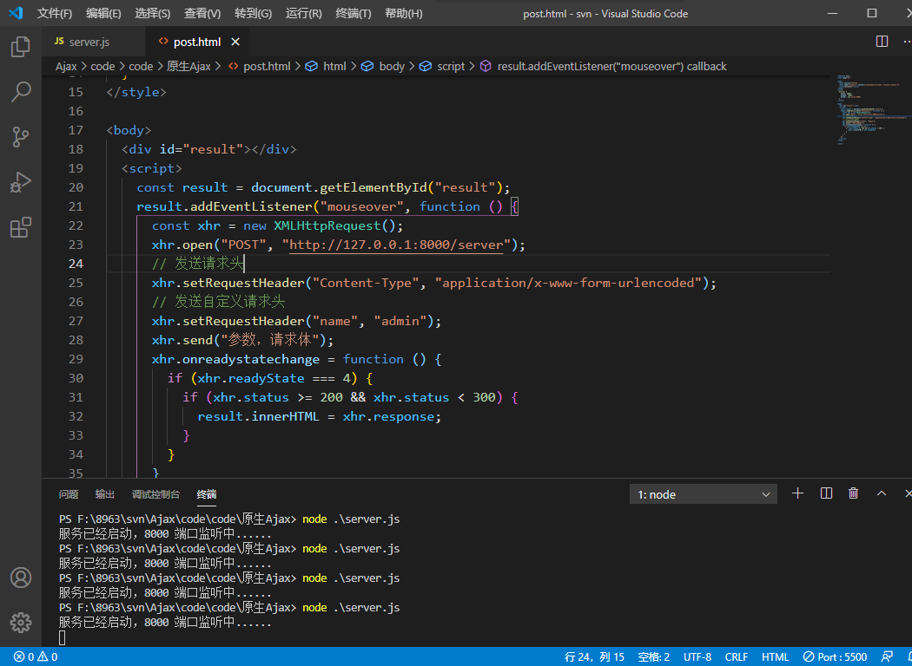

自定义请求头报错解决办法

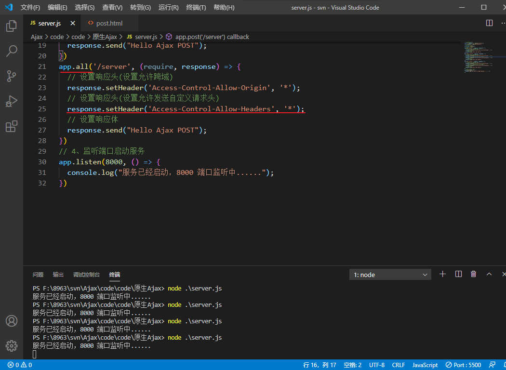


#### Ajax 响应 json 数据

【服务端返回json数据】

> response.send() 方法只能返回字符串类型数据，需要使用 `JSON.stringify()` 进行转换 

```JavaScript
app.all('/server-json', (require, response) => {
  // 设置响应体
  const data = {
    name: 'zy'
  }
  // 对对象进行字符串转换 json->string
  let str = JSON.stringify(data);
  response.send(str);
})
```

【网页端接收 json 】

两种方式转换 json 格式数据

1. 手动转换

   ```JavaScript
   let data = JSON.parse(xhr.response);
   ```

   

2. 自动转换 - 设置响应体数据类型

   ```JavaScript
   xhr.responseType = 'json';
   ```

   

```html
  <script>
    const result = document.getElementById("result");
    window.onkeydown = function () {
      const xhr = new XMLHttpRequest();
      // 设置响应体数据类型
      xhr.responseType = 'json';
      xhr.open("GET", "http://127.0.0.1:8000/server-json");
      xhr.send();
      xhr.onreadystatechange = function () {
        if (xhr.readyState === 4) {
          if (xhr.status >= 200 && xhr.status < 300) {
            // result.innerHTML = xhr.response;
            // 手动对数据进行转换 srting->json
            // let data = JSON.parse(xhr.response);
            // 自动转化-设置响应体数据类型
            console.log(xhr.response);
            result.innerHTML = xhr.response.name;
          }
        }
      }
    }
  </script>
```


#### nodemon 自动重启工具

[地址](https://www.npmjs.com/package/nodemon)

```
npm i -g nodemon
```

全局安装此工具之后，启动服务不再使用`node 服务名`

而是使用 `nodemon 服务名`

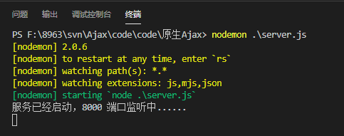


#### IE缓存问题解决

```javascript
xhr.open("GET", "http://127.0.0.1:8000/ie?t=" + Date.now());
```

获取当前时间戳，每次获取的时间戳都不一致，浏览器每次获取的请求都不一致

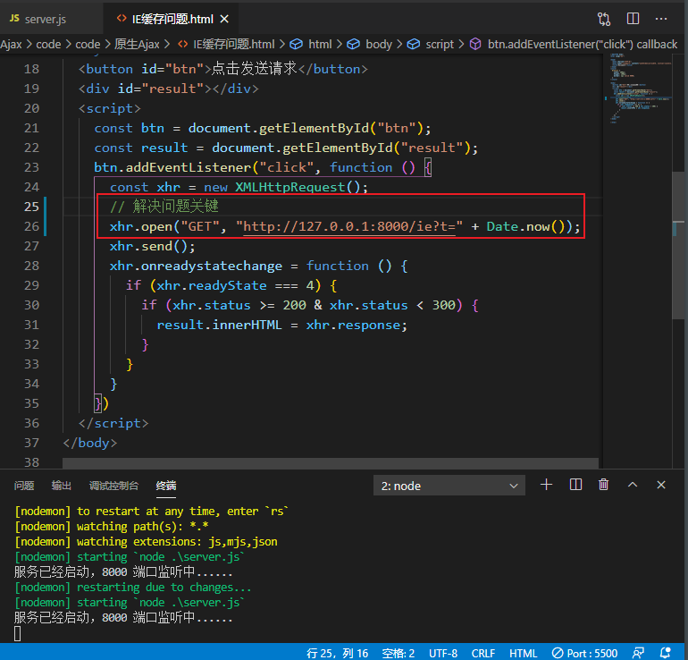


#### Ajax请求超时与网络异常问题

【服务端延时返回数据】

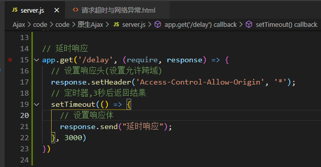

当服务器出现延时或者网络异常时

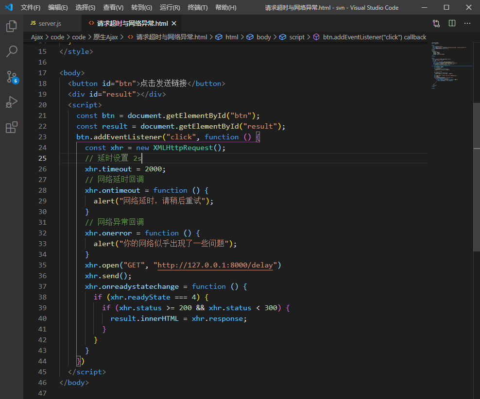

谷歌浏览器网络异常测试方法：

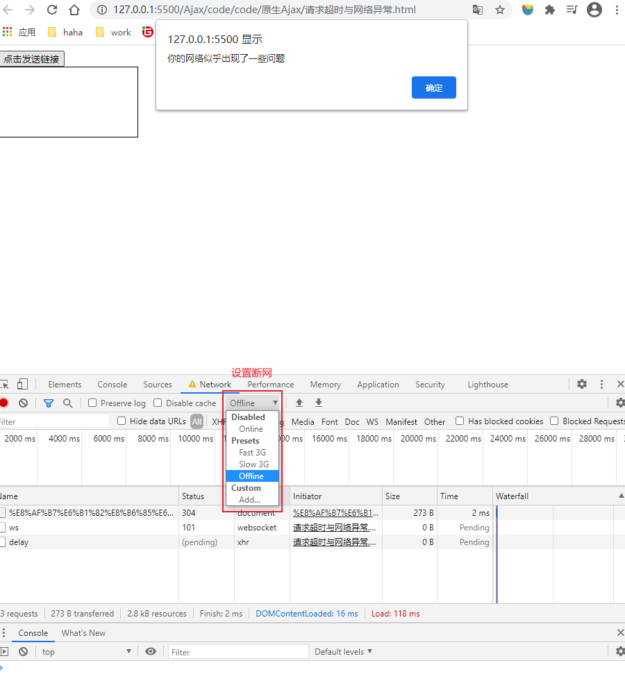

#### Ajax 取消请求

Ajax手动取消请求

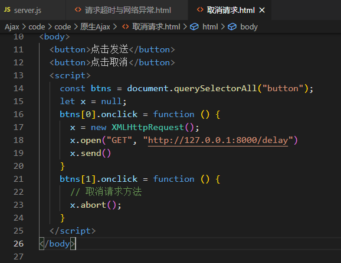


#### Ajax请求重复发送

使用 `isSending` 标识符识别相同的请求

```html
<body>
  <button>点击发送</button>
  <script>
    const btns = document.querySelectorAll("button");
    let x = null;
    // 是否正在发送Ajax请求
    let isSending = false;
    btns[0].onclick = function () {
      // 判断标识变量
      if (isSending) x.abort();
      x = new XMLHttpRequest();
      isSending = true;
      x.open("GET", "http://127.0.0.1:8000/delay")
      x.send()
      x.onreadystatechange = function () {
        if (x.readyState === 4) {
          isSending = false;
        }
      }
    }
  </script>
</body>
```


#### jQuery中Ajax

1. get 请求

   ```javascript
   $.get(url,[data],[callback],[type])
   ```

   - **url** - 请求的 URL 地址
   - **data** - 请求携带的参数
   - **callback** - 载入成功的回调函数
   - **type** - 设置返回内容的格式，xml，html，script，json，text，_default

2. post 请求

   ```
   $.get(url,[data],[callback],[type])
   ```

   - **url** - 请求的 URL 地址
   - **data** - 请求携带的参数
   - **callback** - 载入成功的回调函数
   - **type** - 设置返回内容的格式，xml，html，script，json，text，_default

   

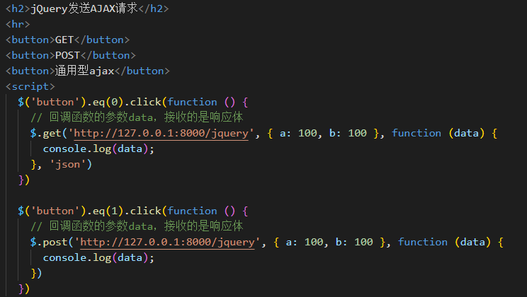


3. ajax通用请求

   ```javascript
   $('button').eq(2).click(function () {
         // 回调函数的参数data，接收的是响应体
         $.ajax({
           // url
           url: 'http://127.0.0.1:8000/jquery',
           // 参数
           data: { a: 100, b: 200 },
           // 响应体结果
           dataType: 'json',
           // 请求类型
           type: 'GET',
           // 超时时间
           timeout: 2000,
           // 成功的回调
           success: function (data) {
             console.log(data);
           },
           // 失败的回调
           error: function () {
             console.log("出错了！");
           }
         })
       })
   ```

   

#### Axios 发送 AJAX 请求-GET、POST

GET 和 POST

```JavaScript
  <script>
    const btns = document.querySelectorAll('button');
    // 配置baseURL
    axios.defaults.baseURL = 'http://127.0.0.1:8000';
    btns[0].onclick = function () {
      // GET请求
      axios.get('/axios', {
        params: {
          id: 100,
          vip: 7
        },
        headers: {
          name: 'haha',
          age: 20
        }
      }).then(value => {
        console.log(value);
      })
    }

    btns[1].onclick = function () {
      // POST请求
      axios.post('/axios', {
        name: 'admin',
        pass: 'admin'
      }, {
        params: {
          id: 100,
          vip: 7
        },
        headers: {
          name: 'haha',
          age: 20
        }
      }).then(value => {
        console.log(value);
      })
    }
  </script>
```


#### Axios 发送 AJAX 请求-通用


```JavaScript
btns[2].onclick = function () {
      axios(
        {
          // 请求方法
          method: 'POST',
          // url
          url: '/axios',
          params: {
            id: 10,
            vip: 30
          },
          headers: {
            name: 'haha',
            age: 20
          },
          data: {
            name: 'admin',
            pass: 'admin'
          }
        }).then(value => {
          console.log(value);
        })
    }
```


#### 使用 fetch() 函数发送 Ajax 请求

https://developer.mozilla.org/zh-CN/docs/Web/API/WindowOrWorkerGlobalScope/fetch

```javascript
  <script>
    const btn = document.querySelector('button');
    btn.onclick = function () {
      fetch('http://127.0.0.1:8000/fetch', {
        // 请求方法
        method: 'POST',
        // 请求头
        headers: {
          name: "fetch"
        },
        // 请求体
        body: 'username=admin&password=admin'
      }).then(res => {
        // return res.text();
        return res.json();
      }).then(res => {
        console.log(res);
      })
    }
  </script>
```


#### Ajax 同源策略

同源策略(`Same-Origin Policy`)，是浏览器的一种安全策略。

同源：协议、域名、端口号，必须完全相同

违背同源策略就是跨域。

【响应一个页面】

```JavaScript
const { response } = require('express');
const express = require('express');
const app = express();
app.get('/home', (request, response) => {
  response.sendFile(__dirname + '/index.html');
});
app.listen(9000, () => {
  console.log('服务已经启动...');
})
```

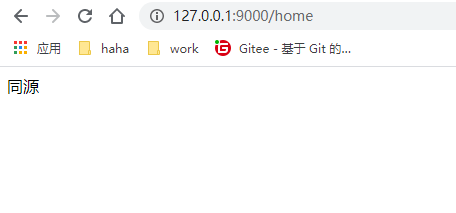


#### JSONP 实现原理

**JSONP**  `JSON withPadding `，是一个非官方的跨域解决方案，只支持 get 请求。

jsonp工作：

在网页有一些标签天生具有跨域能力，比如：img、link、iframe、script

JSONP 就是利用 script 标签的跨域能力来发送请求的。

**JSONP的使用**

【网页】

```JavaScript
  <script>
    const input = document.querySelector('input');
    const p = document.querySelector('p');
    // 声明 handle 函数
    function handle(data) {
      input.style.border = 'solid 1px #f00';
      p.innerHTML = data.msg;
      // console.log(data);
    }
    input.onblur = function () {
      // 获取用户输入
      let username = this.value;
      // 向服务端发送请求，检测用户名是否存在
      // 1、创建 script 标签
      const script = document.createElement('script');
      // 2、设置标签的 src 属性
      script.src = 'http://127.0.0.1:8000/check-username';
      // 3、将 script 插入到文档中
      document.body.appendChild(script);
    }
  </script>
```

【服务端】

```JavaScript
// 用户名检测是否存在
app.all('/check-username', (request, response) => {
  const data = {
    exist: 1,
    msg: '用户名已经存在'
  };
  let str = JSON.stringify(data);
  response.end(`handle(${str})`);
})
```


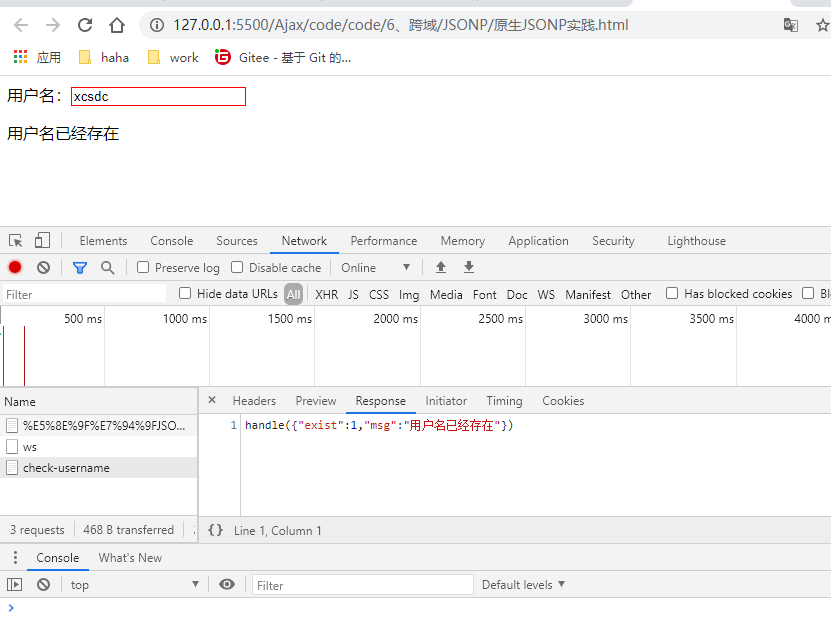

#### 使用 jQuery 发送 jsonp 请求

【网页端】

```JavaScript
  <script>
    $('button').eq(0).click(function () {
      $.getJSON('http://127.0.0.1:8000/jQuery-jsonp?callback=?', function (data) {
        $('#result').html(`${data.msg}`)
      })
    })
  </script>
```

【服务端】

```JavaScript
// jQuery-jsonp
app.all('/jQuery-jsonp', (request, response) => {
  const data = {
    exist: 1,
    msg: 'haha'
  };
  let str = JSON.stringify(data);
  // 接受 callback 参数
  let cb = request.query.callback;
  response.end(`${cb}(${str})`);
})
```


#### 跨域 - CORS

CORS  (`cross-Origin Resource Sharing`)  ，跨域资源共享。

是官方跨域解决方案，不需要客户端做任何特殊操作，完全在服务器中进行处理，支持get和post请求。

CORS 标准新增了一组 HTTP 首部字段，允许服务器声明哪些源站通过浏览器有权限访问哪些资源。


**工作**

CORS 通过设置一个响应头来告诉浏览器，该请求允许跨域，浏览器收到该响应后就会对该响应放行。


**使用**

https://developer.mozilla.org/zh-CN/docs/Web/HTTP/Access_control_CORS

【服务端】

```JavaScript
// CORS
app.all('/cors', (request, response) => {
  // 设置跨域响应头
  response.setHeader("Access-Control-Allow-Origin", "*");
  response.setHeader("Access-Control-Allow-Headers", "*");
  response.setHeader("Access-Control-Allow-Method", "*");
  response.send('hello CORS!');
})
```

- `("Access-Control-Allow-Origin", "*")`

  "*" 指定了允许访问该资源的外域 URI

- `("Access-Control-Allow-Headers", "*")`

  让服务器把允许浏览器访问的头放入白名单

- `("Access-Control-Allow-Method", "*")`

  其指明了实际请求所允许使用的 HTTP 方法。

