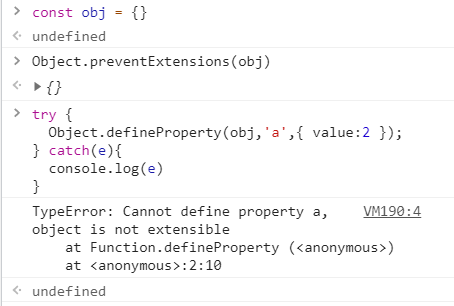
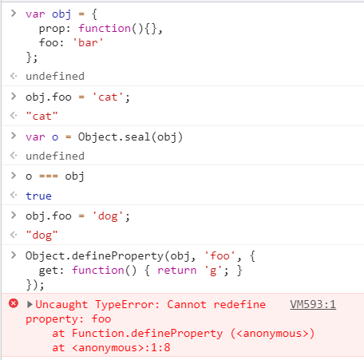
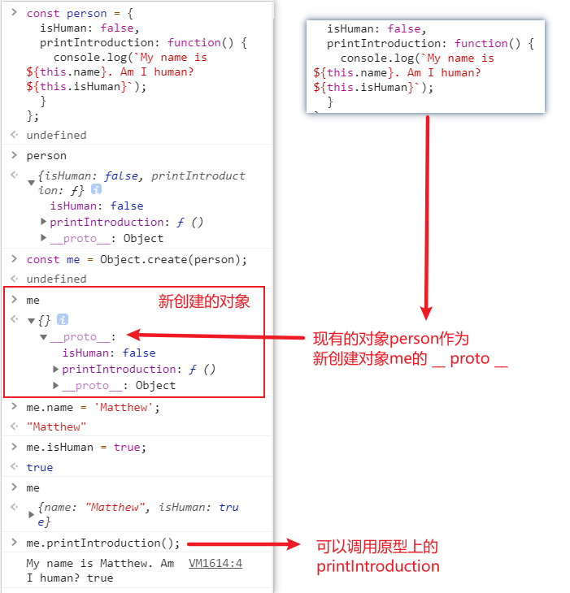
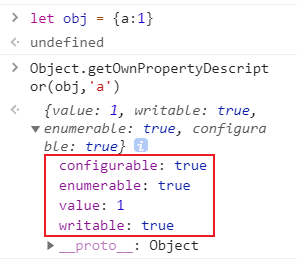
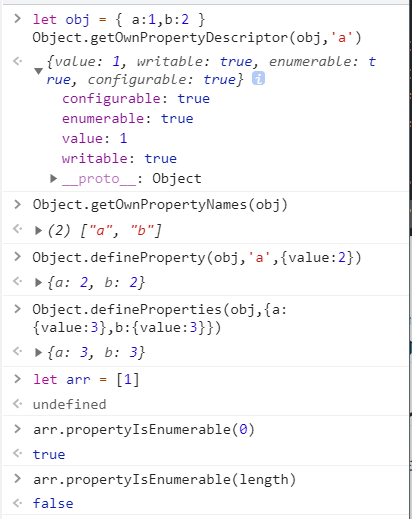
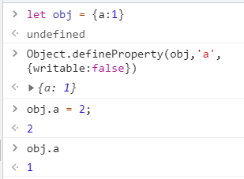
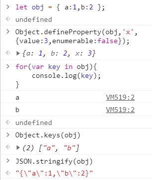
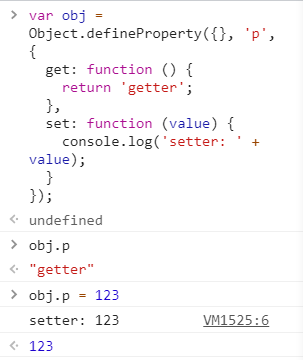
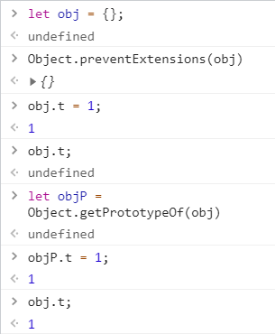

# Object 对象

JavaScript 原生提供`Object`对象。

JavaScript 的所有其他对象都继承自 Object 对象，即那些对象都是 Object 的实例方法。

Object 对象的原生的方法分成两类：Object 本身的方法与 Object 的实例方法。

**<1> Object 本身的方法**

所谓“本身的方法”就是直接定义在`Object`对象的方法。

```javascript
// 定义
Object.print = function (o) {
  console.log(o);
};
// 调用
Object.print("hi");
```

`print`方法直接定义在`Object`对象上，可以通过 Object 直接调用。

**<2> Object 的实例方法**

所谓实例方法就是定义在`Object`原型对象`Object.prototype`上的方法。它可以被`Object`实例直接使用。

```javascript
Object.prototype.print = function () {
  console.log(this);
};

var obj = new Object();
obj.print(); // Object
```

`Object.prototype`定义了一个`print`方法，然后生成一个`Object`的实例`obj`。

`obj`直接继承了`Object.prototype`的属性和方法，可以直接使用`obj.print`调用`print`方法。

也就是说，`obj`对象的`print`方法实质上就是调用`Object.prototype.print`方法。

凡是定义在`Object.prototype`对象上面的属性和方法，将被所有实例对象共享就可以了。

# Object()

> Object 作为函数的用法

`Object`本身是一个函数，可以当作工具方法使用，将任意值转为对象。这个方法常用于保证某个值一定是对象。

如果参数为空（或者为`undefined`和`null`），`Object()`返回一个空对象。

`instanceof`运算符用来验证，一个对象是否为指定的构造函数的实例。

`obj instanceof Object`返回`true`，就表示`obj`对象是`Object`的实例。

如果参数是原始类型的值，`Object`方法将其转为对应的包装对象的实例。

```JavaScript
var obj = Object(1);
obj instanceof Object // true
obj instanceof Number // true

var obj = Object('foo');
obj instanceof Object // true
obj instanceof String // true

var obj = Object(true);
obj instanceof Object // true
obj instanceof Boolean // true
```

转换成对象就是原始类型值对应的包装对象。

如果`Object`方法的参数是一个对象，它总是返回该对象，即不用转换。利用这一特点，编写一个判断变量是否为对象的函数。

```javascript
function isObject(value) {
  return value === Object(value);
}
isObject([]);
isObject(true);
```

# Object 构造函数

Object 不仅可以作为工具函数使用，还可以当作构造函数使用，即前面可以使用 new 命令。

Object 构造函数的首要用途，是直接通过它来生成新对象。

```javascript
var obj = new Object();
```

> 注意，通过`var obj = new Object()`的写法生成新对象，与字面量的写法`var obj = {}`是等价的

`Object`构造函数的用法与工具方法很相似，几乎一模一样。使用时，可以接受一个参数，如果该参数是一个对象，则直接返回这个对象；如果是一个原始类型的值，则返回该值对应的包装对象

虽然用法相似，但是`Object(value)`与`new Object(value)`两者的语义是不同的，`Object(value)`表示将`value`转成一个对象，`new Object(value)`则表示新生成一个对象，它的值是`value`。

# Object 的静态方法

所谓“静态方法”，是指部署在`Object`对象自身的方法。

## 遍历对象的属性

- Object.keys()

- Object.getOwnPropertyNames()

**Object.keys()** 方法参数是一个对象，返回一个数组。

该数组的成员都是该对象自身的（而不是继承的）所有**属性名**。

**Object.getOwnPropertyNames()**

接受一个对象作为参数，返回一个数组，包含了该对象自身的所有**属性名**。

```javascript
var obj = {
  p1:123,
  p2:456;
};
Object.keys(obj);
Object.getOwnPropertyNames(obj);
```

区别：

`Object.keys` 方法只返回可枚举的属性

`Object.getOwnPropertyNames` 方法还返回不可枚举的属性名

```javascript
var a = ["Hello", "World"];

Object.keys(a); // ["0", "1"]
Object.getOwnPropertyNames(a); // ["0", "1", "length"]
```

数组的`length`属性是不可枚举的属性

由于 JavaScript 没有提供计算对象属性个数的方法，所以可以用这两个方法代替。

```javascript
var obj = {
  p1: 123,
  p2: 456,
};

Object.keys(obj).length; // 2
Object.getOwnPropertyNames(obj).length; // 2
```

一般情况下，几乎总是使用`Object.keys`方法，遍历对象的属性。

## 其他静态方法

### 对象属性模型的相关方法

- Object.getOwnPropertyDescriptor()

  获取某个属性的描述对象

  

- Object.defineProperty()

  通过描述对象，定义某个属性。

  

- Object.defineProperties()

  通过描述对象，定义多个属性。

  

### 控制对象状态的方法

- Object.preventExtensions()

  防止对象扩展。也就是永远不能再添加新的属性。

  ```javascript
  const obj = {};
  Object.preventExtensions(obj);
  try {
    Object.defineProperty(obj, "a", { value: 2 });
  } catch (e) {
    console.log(e);
  }
  ```

  

- Object.isExtensible()

  判断对象是否可扩展。

  ```javascript
  Object.isExtensible(obj); //falselet obj2 = {}Object.isExtensible(obj2)	//true
  ```

- Object.seal()

  禁止对象配置。封闭一个对象，阻止添加新属性并将所有现有属性标记为不可配置。

  ```javascript
  var obj = {
    prop: function(){},
    foo: 'bar'};
    obj.foo = 'cat';
  var o = Object.seal(obj)o === obj
  // trueobj.foo = 'dog';
  Object.defineProperty(obj, 'foo', {
    get: function() { return 'g'; }});
  // Uncaught TypeError: Cannot redefine property: foo
  //    at Function.defineProperty (<anonymous>)
  ```

  

- Object.isSealed()

  判断一个对象是否被密封。

  

- Object.freeze()

  冻结一个对象。一个被冻结的对象再也不能被修改

- Object.isFrozen()

  判断一个对象是否被冻结。

### 原型链相关的方法

- Object.create()

  指定原型对象和属性，返回一个新的对象。

  > MDN
  >
  > 创建一个新对象，使用现有的对象来提供新创建的对象的** proto **

  ```javascript
  const person = {
    isHuman: false,
    printIntroduction: function () {
      console.log(`My name is ${this.name}. Am I human? ${this.isHuman}`);
    },
  };
  const me = Object.create(person);
  me.name = "Matthew";
  me.isHuman = true;
  me.printIntroduction();
  ```

  执行结果：

  

- Object.getPrototypeOf()

  获取对象的`Prototype`对象

  

# Object 的实例方法

除了静态方法，还有不少方法定义在`Object.prototype`对象。它们称为实例方法，所有`Object`的实例对象都继承了这些方法。

`Object` 实例对象的主要方法：

- `Object.prototype.valueOf()`：返回当前对象对应的值。

- `Object.prototype.toString()`：返回当前对象对应的字符串形式。

- `Object.prototype.toLocaleString()`：返回当前对象对应的本地字符串形式。

- `Object.prototype.hasOwnProperty()`：判断某个属性是否为当前对象自身的属性，还是继承自原型对象的属性。

- `Object.prototype.isPrototypeOf()`：判断当前对象是否为另一个对象的原型。

  

- `Object.prototype.propertyIsEnumerable()`：判断某个属性是否可枚举。

```javascript
let arr = []arr[0] = 1arr.propertyIsEnumerable(0)arr.propertyIsEnumerable(length)
```

## Object.prototype.valueOf()

`valueOf`方法的作用是返回一个对象的“值”，默认情况下返回对象本身。

```javascript
var obj = new Object();
obj.valueOf() === obj; // true
```

valueOf() 方法的主要用途是，JavaScript 自动类型转换时会调用此方法。

```javascript
var obj = new Object();
1 + obj; // "1[object Object]"// 	使用valueOfobj.valueOf = function(){  return 2;}1 + obj	// 3
```

自定义了`obj`对象的`valueOf`方法，于是`1 + obj`就得到了`3`。这种方法就相当于用自定义的`obj.valueOf`，覆盖`Object.prototype.valueOf`。

## Object.prototype.toString()

`toString`方法的作用是返回一个对象的字符串形式，默认情况下返回类型字符串。

```javascript
let obj = { a: 1, b: 2 };
obj.toString(); //"[object Object]"
```

对于一个对象调用`toString`方法，会返回字符串`[object Object]`，该字符串说明对象的类型。

```javascript
function Dog(name) {
  this.name = name;
}
const dog1 = new Dog("Gabby");
Dog.prototype.toString = function dogToString() {
  return `${this.name}`;
};
console.log(dog1.toString());
```

**使用 toString() 查看数据类型**

由于实例对象可能会自定义`toString`方法，覆盖掉`Object.prototype.toString`方法，所以为了得到类型字符串，最好直接使用`Object.prototype.toString`方法。通过函数的`call`方法，可以在任意值上调用这个方法，帮助我们判断这个值的类型。

```javascript
Object.prototype.toString.call(value);
```

不同数据类型的`Object.prototype.toString`方法返回值如下。

```javascript
Object.prototype.toString.call(2); // "[object Number]"
Object.prototype.toString.call(""); // "[object String]"
Object.prototype.toString.call(true); // "[object Boolean]"
Object.prototype.toString.call(undefined); // "[object Undefined]"
Object.prototype.toString.call(null); // "[object Null]"
Object.prototype.toString.call(Math); // "[object Math]"
Object.prototype.toString.call({}); // "[object Object]"
Object.prototype.toString.call([]); // "[object Array]"
```

## Object.prototype.toLocaleString()

`Object.prototype.toLocaleString`方法与`toString`的返回结果相同，也是返回一个值的字符串形式。

这个方法的主要作用是留出一个接口，让各种不同的对象实现自己版本的`toLocaleString`，用来返回针对某些地域的特定的值。

```javascript
var person = {
  toString: function () {
    return "Henry Norman Bethune";
  },
  toLocaleString: function () {
    return "白求恩";
  },
};
person.toString(); // Henry Norman Bethuneperson.toLocaleString() // 白求恩
```

## Object.prototype.hasOwnProperty()

`Object.prototype.hasOwnProperty`方法接受一个字符串作为参数，返回一个布尔值，表示该实例对象自身是否具有该属性。

```javascript
let obj = {a:1}obj.hasOwnProperty("a")	//true
```

# 属性描述对象

JavaScript 提供了一个内部数据结构，用来描述对象的属性，控制它的行为，比如该属性是否可写、可遍历等等。这个内部数据结构称为“属性描述对象”（attributes object）。每个属性都有自己对应的属性描述对象，保存该属性的一些元信息。



下面是属性描述对象的一个例子。

```javascript
{  configurable: true,  enumerable: true,  value: 1,  writable: false,  get: undefined,  set: undefined}
```

# 关于属性方法

Object.getOwnPropertyDescriptor()方法可以获取属性描述对象

Object.getOwnPropertyNames() 遍历对象属性名

Object.defineProperty() 通过描述对象，定义某个属性。

Object.defineProperties() 通过描述对象，定义多个属性。

Object.propertyIsEnumerable() 判断某个属性是否可枚举。

```javascript
let obj = { a: 1, b: 2 };
Object.getOwnPropertyDescriptor(obj, "a");
Object.getOwnPropertyNames(obj);
Object.defineProperty(obj, "a", { value: 2 });
Object.defineProperties(obj, { a: { value: 3 }, b: { value: 3 } });
let arr = [1];
arr.propertyIsEnumerable(0);
arr.propertyIsEnumerable(length);
```

执行结果：



# 元属性

## value

`value`属性是目标属性的值。

```javascript
let obj = { a: 1 }; // 读取Object.getOwnPropertyDescriptor(obj, 'a').value// 改写Object.defineProperty(obj, 'a', { value: 246 });
```

## writable

`writable`属性是一个布尔值，决定了目标属性的值（value）是否可以被改变。

```javascript
let obj = {a:1}Object.defineProperty(obj,'a',{writable:false})obj.a = 2;obj.a
```



当 writable 的值为 false 时，正常模式下修改属性值不会报错，而严格模式下会。

## enumerable

`enumerable`（可遍历性）返回一个布尔值，表示目标属性是否可遍历。

具体来说，如果一个属性的`enumerable`为`false`，下面三个操作不会取到该属性。

- `for..in`循环
- `Object.keys`方法
- `JSON.stringify`方法

因此，`enumerable`可以用来设置“秘密”属性。

```javascript
var obj = {};
Object.defineProperty(obj, "x", { value: 123, enumerable: false });
obj.x; // 123for (var key in obj) {  console.log(key);}// undefinedObject.keys(obj)  // []JSON.stringify(obj) // "{}"
```

执行结果：



## configurable

`configurable`(可配置性）返回一个布尔值，决定了是否可以修改属性描述对象。也就是说，`configurable`为`false`时，`value`、`writable`、`enumerable`和`configurable`都不能被修改了。

> 注意，`writable`只有在`false`改为`true`会报错，`true`改为`false`是允许的。
>
> 至于`value`，只要`writable`和`configurable`有一个为`true`，就允许改动。

# 存取器

属性还可以用存取器（accessor）定义。其中，存值函数称为`setter`，使用属性描述对象的`set`属性；取值函数称为`getter`，使用属性描述对象的`get`属性。

一旦对目标属性定义了存取器，那么存取的时候，都将执行对应的函数。

```javascript
let obj = Object.defineProperty({}, "p", {
  get: function () {
    return "getter";
  },
  set: function (value) {
    console.log("setter:" + value);
  },
});
obj.pobj.p = 123;
```

执行结果：



存取器还有一种写法，此写法在实际开发中更常用

```javascript
let obj = {
  get p() {
    return "getter";
  },
  set p(value) {
    console.log("setter:" + value);
  },
};
```

> 第一种写法，属性`p`的`configurable`和`enumerable`都为`false`，从而导致属性`p`是不可遍历的；
>
> 第二种写法，属性`p`的`configurable`和`enumerable`都为`true`，因此属性`p`是可遍历的。实际开发中，写法二更常用。

存取器往往用于，属性的值依赖对象内部数据的场合。

```javascript
let obj = {
  $n: 5,
  get next() {
    return this.$n++;
  },
  set next(n) {
    if (n >= this.$n) this.$n = n;
    else throw new Error("新的值必须大于当前值");
  },
};
obj.next = 6;
obj.next = 1;
```


# 对象的拷贝

有时，我们需要将一个对象的所有属性，拷贝到另一个对象，可以用下面的方法实现。

```javascript
var extend = function (to, from) {
  for (var property in from) {
    to[property] = from[property];
  }
  return to;
};
extend({}, { a: 1 });
```

这个方法在于，如果遇到存储器定义的属性，会只拷贝值

```javascript
extend(
  {},
  {
    get a() {
      return 1;
    },
  }
);
```

为了解决这个问题，我们可以通过`Object.defineProperty`方法来拷贝属性。

```javascript
var extend = function (to, from) {
  for (var property in from) {
    // hasOwnProperty 判断对象是否存在该属性
    if (!from.hasOwnProperty(property)) continue; // defineProperty设置属性，（设置属性的对象，设置的属性名，设置属性的值）
    Object.defineProperty(
      to,
      property,
      // 获取属性值，（从对象获取属性，属性名）
      Object.getOwnPropertyDescriptor(from, property)
    );
  }
  return to;
};
```

上面代码中，`hasOwnProperty`那一行用来过滤掉继承的属性，否则可能会报错，因为`Object.getOwnPropertyDescriptor`读不到继承属性的属性描述对象。

# 控制对象状态

有时需要冻结对象的读写状态，防止对象被改变。JavaScript 提供了三种冻结方法，最弱的一种是`Object.preventExtensions`，其次是`Object.seal`，最强的是`Object.freeze`。

## 扩展状态（添加）

`Object.preventExtensions`方法可以使得一个对象无法再添加新的属性。

`Object.isExtensible` 检查是否可以为一个对象添加属性。

## 封闭对象（添加删除）

`Object.seal`方法使得一个对象既无法添加新属性，也无法删除旧属性。

`Object.isSealed`方法用于检查一个对象是否使用了`Object.seal`方法。

## 冻结对象（添加删除改变）

`Object.freeze`方法可以使得一个对象无法添加新属性、无法删除旧属性、也无法改变属性的值，使得这个对象实际上变成了常量。

`Object.isFrozen`方法用于检查一个对象是否使用了`Object.freeze`方法。

## 局限性

上面的三个方法锁定对象的可写性有一个漏洞：可以通过改变原型对象，来为对象增加属性。

```javascript
let objP = Object.getPrototypeOf(obj)objP.t = 1;obj.t;
```

获取原型，将变量添加到原型上



解决方案：把 obj 的原型也冻结住。

```javascript
var obj = new Object();
Object.preventExtensions(obj);
var proto = Object.getPrototypeOf(obj);
Object.preventExtensions(proto);
```

另外一个局限是，如果属性值是对象，上面这些方法只能冻结属性指向的对象，而不能冻结对象本身的内容。

```javascript
var obj = { foo: 1, bar: ["a", "b"] };
Object.freeze(obj);
obj.bar.push("c");
obj.bar; // ["a", "b", "c"]
```

