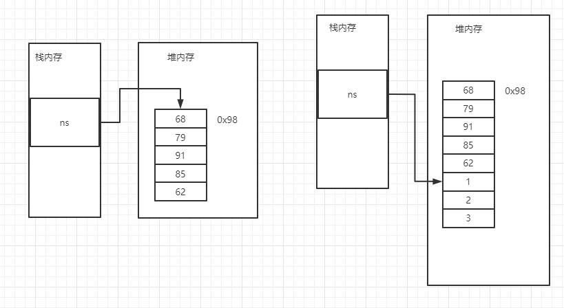
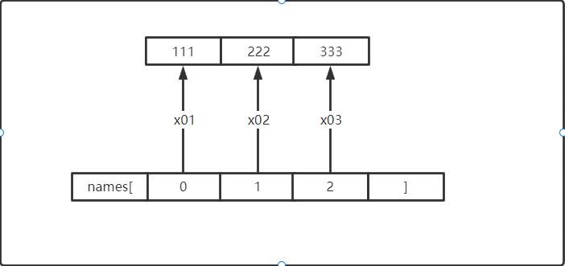
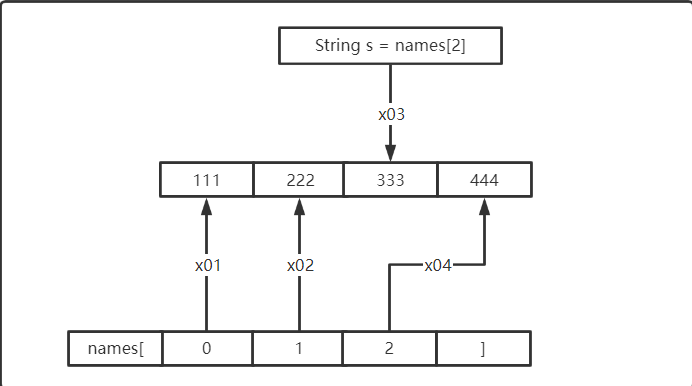

# Java 基础

## 数据类型

基本数据类型：

- 整数类型：byte，short，int，long
- 浮点数类型：float，double
- 字符类型：char
- 布尔类型：boolean

除了上述基本类型的变量，剩下的都是引用类型。引用类型最常用的就是`String`字符串。

使用`final`修饰符定义常量。

```java
//  整数类型：byte，short，int，long
    int i = 456;
//  浮点数类型：float，double
    float f = 4.52f;  //  需要加上f后缀
//  字符类型：char
    char ch = 'A'; //  单引号，单个字符
//  布尔类型：boolean
    boolean b = true;
//  引用类型
    String s = "hello";
//  常量
    final double PI = 3.1415926;
```

## break和continue

**break**

在循环过程中，可以使用`break`语句跳出当前循环。

```java
public static void main(String[] args){
  int sum = 0;
  for(int i=1;i<100;i++){
    sum = sum +i;
    if(i==50){
      break;
    }
  }
  System.out.println(sum); // 50
}
```

> 注意：`brreak`只会跳出自己所在的循环。

**continue**

`break`会跳出当前循环，也就是整个循环都不会执行了。而`continue`则是提前结束本次循环，直接继续执行下次循环。

```java
public static void main(String[] args){
  int sum = 0;
  for(int i=1;i<100;i++){
    sum = sum +1;
    if(i==50){
      continue;
    }
  }
  System.out.println(sum); //99
}
```

> 在多层嵌套的循环中，`continue`语句同样是结束本次自己所在的循环。


## 数组

### 定义数组

定义一个数组类型的变量，使用数组类型“类型[]”，Java的数组有几个特点：

- 数组所有元素初始化为默认值，整型都是`0`，浮点型是`0.0`，布尔型是`false`；
- 数组一旦创建后，大小就不可改变。

访问元素，需要使用索引

修改元素，使用赋值语句，`ns[0]=1`

获取数组大小，`数组变量.length`

```java
int[] ns = new int[5];
ns[0] = 68;
ns[1] = 79;
ns[2] = 91;
ns[3] = 85;
ns[4] = 62;
System.out.println(ns.length);
```

可以在定义数组时直接指定初始化的元素，这样就不必写出数组大小，而是由编译器自动推算数组大小

```java
int[] ns2 = new int[] {1,2,3,4};
System.out.println(ns2.length); //4
```

> 简写声明数组：
>
> ```java
> int[] ns2 = {1,2,3,4};
> ```

注意数组是引用类型，并且数组大小不可变

```java
int[] ns = new int[] { 68, 79, 91, 85, 62 };
ns = new int[] {1,2,3};
System.out.println(ns.length);//3
```

对于数组`ns`来说，执行`ns = new int[] { 68, 79, 91, 85, 62 };`时，它指向一个5个元素的数组，执行`ns = new int[] { 1, 2, 3 };`时，它指向一个新的3个元素的数组。

但是，原有的5个元素的数组并没有改变，只是无法通过变量`ns`引用到它们而已。



**字符串数组**

关于s是“111”还是“444”

```java
String[] names={"111","222","333"};
String s = names[2];
names[2] = "444";
System.out.println(s);
```

图解：

`String[] names={"111","222","333"};`

数组为引用类型，每一个索引存储的都是实际内容在内存中的地址。



`String s = names[2];`

字符串类型变量`s`是引用类型，实际上存储的是“333”的地址


`names[2] = "444";`

names索引2存储“444”实际在内存中地址为 `x04`

变量s存储的地址指向未发生改变，因此s还是“333”



**定义数组总结**

数组是同一数据类型的集合，数组一旦创建后，大小就不可变；

可以通过索引访问数组元素，但索引超出范围将报错；

数组元素可以是值类型（如int）或引用类型（如String），但数组本身是引用类型；


## 遍历数组

方法一：`for`循环

```java
int[] ns = {1,2,3,4,5,};
for (int i=0;i<ns.length;i++){
  System.out.println(ns[i]);
}
```

方法二：`for each`循环

```java
int[] ns = {1,2,3,4,5};
for (int i:ns){
  System.out.println(i);
}
```

打印数组内容：使用Java标准库提供的`Arrays.toString()`

```java
import java.util.Arrays;

int[] ns = {1,2,3,4,5,};
System.out.println(Arrays.toString(ns));
```

练习：

倒序打印数组

```java
int[] ns = { 1, 4, 9, 16, 25 };
for(int i=ns.length-1;i>=0;i--){
  System.out.println(ns[i]);
}
```

## 数组排序

冒泡排序算法

冒泡排序的特点是，每一轮循环后，最大的一个数被交换到末尾，因此，下一轮循环就可以“刨除”最后的数，每一轮循环都比上一轮循环的结束位置靠前一位。

[可视化冒泡排序](https://visualgo.net/zh/sorting)

```java
int[] ns = {28, 12, 89, 73, 65, 18, 96, 50, 8, 36};
System.out.println("排序前："+ Arrays.toString(ns));
for(int i=0;i<ns.length-1;i++){
  for (int j=0;j<ns.length-i-1;j++){
    if(ns[j]>ns[j+1]){
      int tem = ns[j];
      ns[j] = ns[j+1];
      ns[j+1] = tem;
    }
  }
}
System.out.println("排序后："+ Arrays.toString(ns));
```

Java的标准库已经内置了排序功能，我们只需要调用JDK提供的`Arrays.sort()`就可以排序：

## 多维数组

### 二维数组

二维数组就是数组的数组

打印一个二维数组，可以使用两层嵌套的for循环

```java
int[][] ns = {
  {1,2,3,4},
  {5,6,7,8}
};
System.out.println(Arrays.toString(arr0));
for (int[] n:ns){
  for (int m:n){
    System.out.println(m);
  }
}
```

打印二维数组还可以使用Java标准库的`Arrays.deepToString()`：（推荐）

```java
int[][] ns = {
  {1,2,3,4},
  {5,6,7,8}
};
System.out.println(Arrays.deepToString(ns));
```

### 三维数组

三维数组就是二维数组的数组。

```java
int[][][] ns = {
	{{1,2},{3,4}},
	{{5,6},{7,8}}
};
System.out.println(Arrays.deepToString(ns));
```


**练习**

使用二维数组可以表示一组学生的各科成绩，请计算所有学生的平均分：

```java
int[][] scores = {
  { 82, 90, 91 },
  { 68, 72, 64 },
  { 95, 91, 89 },
  { 67, 52, 60 },
  { 79, 81, 85 },
};
double average = 0;
int num = 0;
for (int i =0;i<scores.length;i++){
  for (int j=0;j<scores[i].length;j++){
    average+=scores[i][j];
    num+=1;
  }
}
average = average/num;
Systrintln(average);
```


