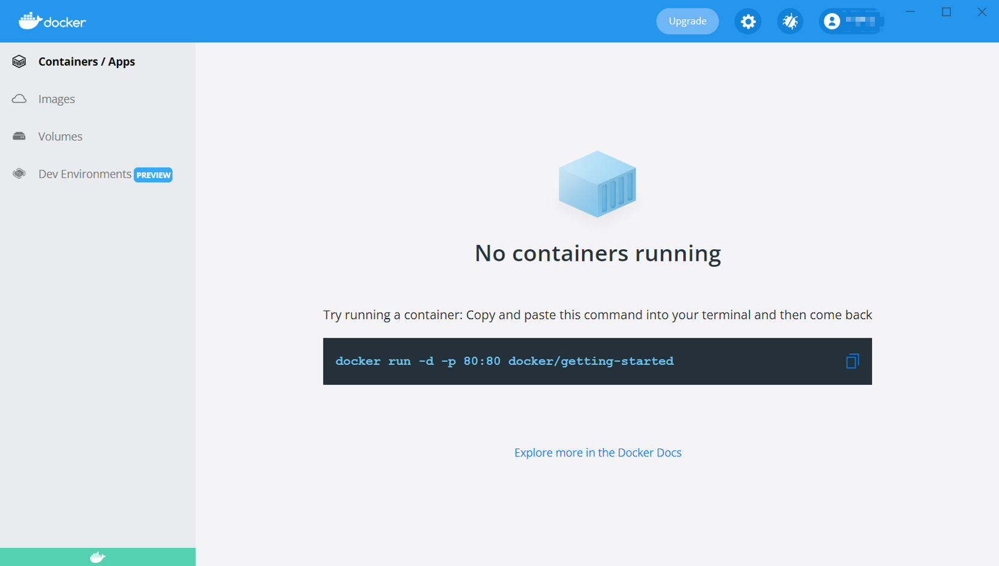
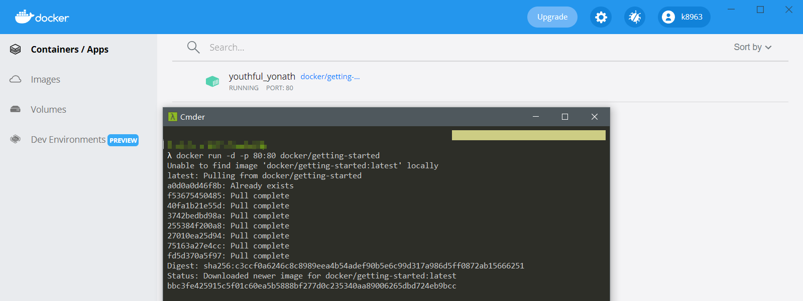
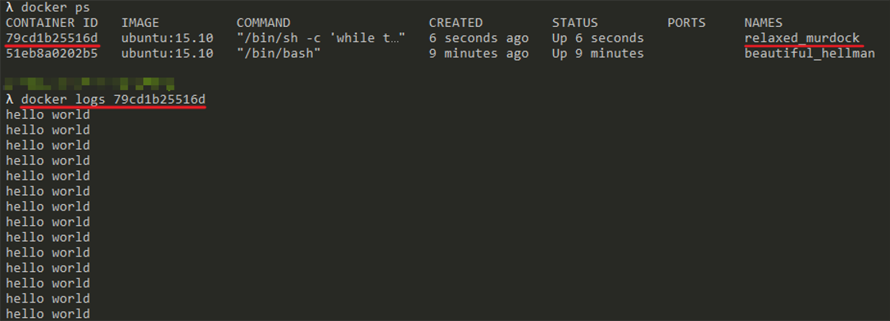
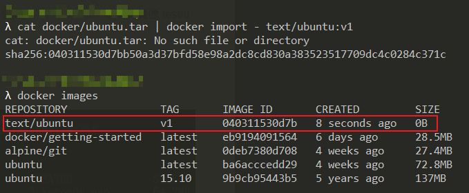

# 初始



尝试运行容器:将此命令复制并粘贴到终端:

```
docker run -d -p 80:80 docker/getting-started
```

[docker run](https://www.runoob.com/docker/docker-run-command.html)

- `docker run`创建一个新的容器并运行一个命令

- `-d` 后台运行容器，并返回容器ID；
- `-p` 指定端口映射，格式为：主机(宿主)端口:容器端口
- `docker/getting-started`  镜像名称

运行结果:



[Docker 命令大全](https://m.runoob.com/docker/docker-command-manual.html)


# Hello world

```
docker run ubuntu:15.10 /bin/echo "Hello world"
```

- `docker run` 运行一个容器
- `ubuntu:15.10` 指定运行的镜像
- `/bin/echo "Hello world"` 在启动的容器里面执行命令

此命令的完整解释为,Docker 以 ubuntu15.10 镜像创建了一个新容器,然后在容器里面执行 bin/echo "Hello world" 然后输出结果.


## 运行交互式容器

```
docker run -i -t ubuntu:15.10 /bin/bash
```

- `-i`  以交互模式运行容器，通常与 -t 同时使用；
- `-t`  为容器重新分配一个伪输入终端，通常与 -i 同时使用；

此时,就已经进入了一个`ubuntu15.10`系统的容器


可以在此ubuntu容器中查看


退出容器

```
# exit
或者
Ctrl+D
```


## 启动后台运行的容器

使用以下命令创建一个以进程方式运行的容器

```
docker run -d ubuntu:15.10 /bin/sh -c "while true; do echo hello world; sleep 1; done"
```

- `-d`  后台运行容器，并返回容器ID；

此处输出的就是此命令运行的容器的ID


运行`docker ps` 查看所有正在运行的容器


关于容器的状态:

- created（已创建）
- restarting（重启中）
- running 或 Up（运行中）
- removing（迁移中）
- paused（暂停）
- exited（停止）
- dead（死亡）

在宿主主机内使用 `docker logs` 命令，查看容器内的标准输出：



[docker logs](https://www.runoob.com/docker/docker-logs-command.html) 的后面可以跟**容器的ID**和**容器的名称**,以获取获取容器的日志

## 停止容器

使用命令

```
docker stop 容器的ID或者容器的名称
```


# 使用容器

## 获取镜像

```
$ docker pull 镜像的名称
```


## 启动容器

使用 ubuntu 镜像启动一个容器

```
$ docker run -it ubuntu /bin/bash
```


- `-i` 交互式操作。
- `-t`  终端。
- `ubuntu` ubuntu 镜像。
- `/bin/bash` 放在镜像名后的是命令，这里我们希望有个交互式 Shell，因此用的是 /bin/bash。

## 启动和停止的容器

启动已停止运行的容器:

```
$ docker start 容器的ID
```


停止运行的容器:

```
docker stop 容器ID
```


## 后台运行

```
$ docker run -itd --name ubuntu-test ubuntu /bin/bash
```

- `--name="****"` 为容器指定一个名称；
- `-d` 后台运行容器，并返回容器ID


## 进入容器

在使用 **-d** 参数时，容器启动后会进入后台。此时想要进入容器，可以通过以下指令进入：

```
docker attach 容器ID
或者
docker exec 容器ID  // 推荐使用
```

**注意：**使用 `docker attach`启动的容器, 如果从这个容器退出，会导致容器的停止。

## 删除容器

```
$ docker rm -f 容器的ID或者名称
```


## 导出\导入容器

如果要导出本地某个容器，可以使用 **docker export** 命令。

```
docker export 容器ID > ubuntu.tar
```


可以使用 docker import 从容器快照文件中再导入为镜像，以下实例将快照文件 ubuntu.tar 导入到镜像 test/ubuntu:v1:

```
cat docker/ubuntu.tar | docker import - test/ubuntu:v1
```



此外，也可以通过指定 URL 或者某个目录来导入

# 运行一个WEB应用

尝试使用 docker 构建一个 web 应用程序。将在docker容器中运行一个 Python Flask 应用来运行一个web应用。

```
# 载入镜像
docker pull training/webapp  
# 
docker run -d -P training/webapp python app.py
```

- `-d` 让容器在后台运行。
- `-P` 将容器内部使用的网络端口随机映射到我们使用的主机上。

在主机使用映射的端口启动的web服务


## 重置端口

```
docker run -d -p 5000:5000 training/webapp python app.py
```

重置映射到5000端口

## 查看端口

```
docker port 容器ID
```


## 查看日志

```
docker logs -f 容器ID
```


## 查看WEB应用程序容器的进程

```
docker top 容器ID
```


## 检查web应用

```
docker inspect 容器ID
```

可以查看 Docker 的底层信息。它会返回一个 JSON 文件记录着 Docker 容器的配置和状态信息。


## 停止\启动\删除 web应用程序

docker ps -l 查询最后一次创建的容器：

```
# 停止
docker stop 容器ID
# 启动
docker start 容器ID
# 删除 
docker rm 容器ID
```

删除容器时，容器必须是停止状态


# 使用镜像

## 显示镜像

```
docker images
```


同一仓库源可以有多个 TAG，代表这个仓库源的不同个版本，如 ubuntu 仓库源里，有 15.10、14.04 等多个不同的版本，我们使用 REPOSITORY:TAG 来定义不同的镜像。

如果要使用版本为15.10的ubuntu系统镜像来运行容器时，使用此命令

```
docker run -t -i ubuntu:14.04 /bin/bash 
```

如果你不指定一个镜像的版本标签，docker 将默认使用 ubuntu:latest 镜像。

## 获取镜像

```
docker pull 镜像名称
```


## 查找镜像

```
docker search 镜像名称
```


## 删除镜像

```
docker rmi 镜像ID
```


# 其他问题

## Docker下载太慢

切换镜像,使用[阿里云镜像加速器](https://cr.console.aliyun.com/cn-hangzhou/instances/mirrors)配置


