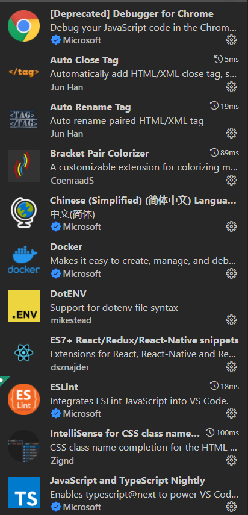
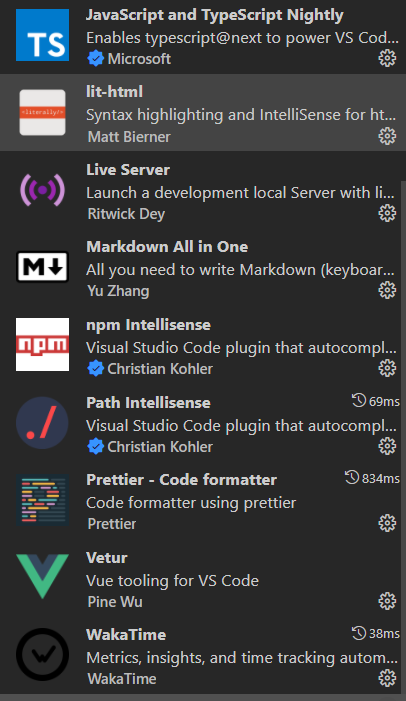

# 插件

1.Auto Close Tag (必备)

　　自动闭合HTML/XML标签

2.Auto Rename Tag (必备)

　　自动完成另一侧标签的同步修改

3.Beautify (必备)

   格式化 html ,js,css

4.Bracket Pair Colorizer (必备)

　　给括号加上不同的颜色，便于区分不同的区块，使用者可以定义不同括号类型和不同颜色

5.Debugger for Chrome (推荐)

　　映射vscode上的断点到chrome上，方便调试

[调试方法戳这](https://blog.csdn.net/example440982/article/details/79587704)

6.ESLint (推荐)

　　js语法纠错，可以自定义配置，不过配置较为复杂

7.JavaScript(ES6) code snippets (必备)

　　ES6语法智能提示，以及快速输入，不仅仅支持.js，还支持.ts，.jsx，.tsx，.html，.vue，省去了配置其支持各种包含js代码文件的时间

12.Markdown Preview Enhanced (推荐)

　　实时预览markdown，markdown使用者必备

15.open in browser (必备)

　　vscode不像IDE一样能够直接在浏览器中打开html，而该插件支持快捷键与鼠标右键快速在浏览器中打开html文件，支持自定义打开指定的浏览器，包括：Firefox，Chrome，Opera，IE以及Safari

设置默认浏览器 

16.Path Intellisense (必备)

　　自动提示文件路径，支持各种快速引入文件

17.React/Redux/react-router Snippets (推荐)(react必备)

　　React/Redux/react-router语法智能提示

24. Npm Intellisense(node必备)

   require 时的包提示

